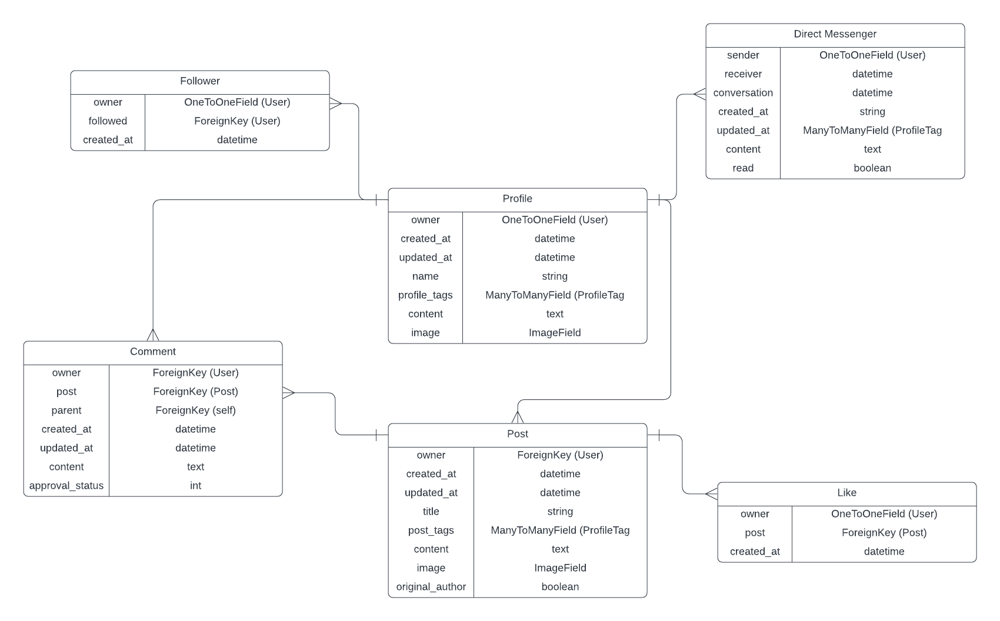

# Inspyre

### Create boldly. Share freely. Discover endlessly.


#### Backend DRF API - for the frontend React app, [click here](https://github.com/MattMiles95/PP5_Inspyre_Frontend).

Inspyre is a modern content-sharing platform designed to empower creativity and connection. Whether you're a digital artist, writer, photographer, or passionate hobbyist, Inspyre gives you the tools to showcase your work, engage with a like-minded community, and discover new inspiration every day.

Powering a dynamic content-sharing platform, the Inspyre DRF API supports secure user authentication, image and text post management, customizable user profiles with tag associations, a simple yet robust profile following system and a built-in direct messaging system.

[Visit the deployed API](https://inspyre-api-6e178387b3cb.herokuapp.com/)

## Table of Contents

### [Design](#design-1)

### [Logic Behind the Features](#features--logic-1)

- [Authorisation](#authorisation)
- [Profiles](#profiles)
- [Posts](#posts)
- [Likes](#likes--trending-posts)
- [Follow System](#post-searchbar)
- [Comments](#comments)
- [Direct Messaging](#direct-messaging)

### [Testing](#testing-1)

### [Project Management - an Agile Approach](#project-management---an-agile-approach-1)

### [Technologies Used](#technologies-used-1)

- [Languages](#languages)
- [Frameworks, Libraries & Programs Used](#frameworks-libraries--programs-used-1)

### [Local Development & Deployment](#local-development--deployment-1)

- [Deployment](#deployment)
- [Forking the GitHub Repository](#forking-the-github-repository)
- [Local Clone](#local-clone)
- [Code Institute PostgreSQL Database](#code-institute-postgresql-database)
- [Cloudinary](#cloudinary)

### [Credits](#credits-1)

- [Affiliations](#affiliations)
- [Code Credits](#code-credits)

<br>

## Design

### Entity Relationship Diagram (ERD)

The ERD below was my original concept for Inspyre's database and the relationship between it's models.



<br>

## Logic Behind the Features

In the frontend app's README docment, I list all of the features utilised by Inspyre. Below I will detail the logic behind each of these features, and how each of the models contained within this project relate to each other.

<br>

### Authorisation

Inspyre implements a robust authorisation system using Django REST Auth and Django Allauth on the backend. This ensures secure authentication while streamlining user registration, login, and session management.

Behind the scenes, Jason Web Token (JWT) authentication is used to manage user sessions securely. Upon login, users are issued an authentication token that must be included with each API request requiring authorisation. Django REST Auth handles the issuing and validation of these tokens, ensuring only authenticated users can access protected endpoints.

Permissions are carefully scoped using Django REST Framework's built-in permission classes, along with custom logic. This ensures users can only perform actions they're authorised for - for example, editing their own posts, accessing their conversations, or managing their own profile - while preventing unauthorised access to other users' data or actions.

<br>

### Profiles

The **Profiles** app manages user profiles, associating each profile with a unique user and allowing them to customize their identity within the platform. Profiles also include user-defined tags that indicate their creative focus (e.g., writer, artist, photographer).

#### Key Features:

- **Profile Creation**: Automatically generated via Django signals when a new user registers.

- **User Information**: Profiles store user information, including name, content (bio), and a profile image.

- **Profile Tags**: Users can assign tags to their profile to indicate their areas of interest or expertise.

- **Data Aggregation**: The app annotates each profile with counts of posts, followers, and following users.

- **Profile Deletion**: The existing Profile model provides for users deleting their own profiles, which cascades to remove all associated data, including posts and comments. This feature has been temporarily removed, however, due to a persistent frontend bug that causes repeat 401 errors following account deletion. This bug is discussed in greater detail within the [frontend README](https://github.com/MattMiles95/PP5_Inspyre_Frontend/blob/main/README.md).

---

#### Relationship with Posts App

Profiles are linked to posts through the owner field in the Posts model. Each profile can be the author of multiple posts, establishing a one-to-many relationship. When a profile is deleted, all associated posts are also removed, preserving data integrity. Post counts are dynamically calculated and included in profile data to provide users with a quick overview of their content contributions.

---

#### Relationship with Comments App

Comments are also linked to profiles through the owner field in the Comments model. This creates a one-to-many relationship between a profile and its comments, allowing for aggregation of comment counts if needed.

The profile’s image and name are included in comment data, providing context and enhancing engagement in comment threads. When a profile is deleted, all associated comments are also removed, preventing orphaned comment data.

---

#### Relationship with Direct Messages App

Profiles are implicitly linked to direct messages through the User model, which serves as both the sender and receiver of messages. The owner field in the Profile model connects each profile to a specific user, allowing for message filtering based on profile data.

Profile information (e.g., profile image, name) is included in direct messages to provide visual context during conversations. When a profile is deleted, all associated messages are also removed, ensuring data consistency and preventing privacy issues.

---

#### Relationship with Followers App

The Followers app manages user relationships, allowing users to follow and be followed by others. Profiles are linked to followers via the owner field, creating a many-to-many relationship between users.

Each profile includes follower and following counts, dynamically calculated based on data in the Followers app. When a profile is deleted, follower and following data are automatically removed, maintaining data integrity.

The following_id field in the ProfileSerializer provides a quick reference to the current user’s follow status with a given profile, streamlining frontend rendering and interaction logic.

---

#### Endpoints:

`/profiles/` - List all profiles with filtering by follower/following status and ordering options.

`/profiles/<id>/` - Retrieve or update a specific profile (if the owner).

`/profiles/<id>/followers/` - Retrieve a list of followers for a specific profile.

`/profiles/<id>/following/` - Retrieve a list of users a specific profile is following.

`/profiles/tags/` - Retrieve all available profile tags for filtering or display.

<br>

### Posts

The **Posts** app allows users to create and share content in the form of text and image-based posts. Posts are associated with their authors (user profiles) and can include tags that provide contextual categorization. Users can also indicate whether they are the original creators of the content by marking a post as an original.

#### Key Features:

- **Content Creation**: Users can create posts with text content, images, or both. The app enforces a 2MB size limit for images and validates image dimensions, capping both width and height at 4096px.

- **Tagging System**: Posts can include tags to categorize content. These tags are dynamically created and associated with posts, enabling search / filtering based on tag names.

- **Approval Status**: The existing Post model provides for posts being marked as either `Approved` (0) or `Reported` (1), with `Approved` being the default value. Reporting a post would temporarily hide it from other users and flag the post for moderation, allowing for content review and potential action. This feature was temporarily removed, as I decided that allowing any user to temporarily hide another user's post with a single report put too much power in the hands of an individual user. As a future feature, this system would be amended so that upon reporting a post, rather than having it immediately hidden pending moderator review, the moderators would instead be notified of the report and _then_ make a decision as to whether it should be removed. This is further discussed within the **Future Features** section of my [frontend README](https://github.com/MattMiles95/PP5_Inspyre_Frontend/blob/main/README.md).

- **Thumbnail Display**: Posts include a `thumbnail` property that generates a content preview. If an image is present, it is used as the thumbnail; otherwise, the content text is truncated to a maximum of 50 words and displayed as a preview.

- **Original Author**: Users can indicate whether they are the original creators of a post. This flag provides transparency for shared content, distinguishing original work from reposts.

---

#### Relationship with Profiles App

Posts are linked to profiles through the `owner` field, establishing a one-to-many relationship. Each profile can be the author of multiple posts, and when a profile is deleted, all associated posts are also removed to maintain data integrity.

Profile data is included in post serializers, allowing for the display of profile images, profile tags, and author information alongside post content.

---

#### Relationship with Comments App

Posts act as the parent object for comments, forming a one-to-many relationship. Each comment is linked to a specific post, and when a post is deleted, all associated comments are also removed.

The `comments_count` field is dynamically calculated for each post, providing a snapshot of engagement activity. This count is displayed alongside the post’s content, indicating the number of comments a post has received.

---

#### Relationship with Likes App

Posts are associated with likes through a one-to-many relationship, where each post can receive multiple likes from different users.

Each like is recorded in the **Likes** app, with a foreign key pointing to the associated post. The `likes_count` field is dynamically calculated for each post, indicating the level of engagement and popularity of a given post.

Users can only like a post once, and the `like_id` field in the `PostSerializer` provides a quick reference to the user's like instance, allowing for efficient like/unlike operations.

When a post is deleted, all associated likes are also removed to maintain data integrity.

---

#### Relationship with Followers App

The **Followers** app indirectly influences post visibility. Posts from followed users can be filtered and displayed using the `owner__followed__owner__profile` field in the `filterset_fields`. The `following_id` field in the **ProfileSerializer** also enables efficient querying of posts from followed users, allowing for features like the personalized Pyres view.

---

#### Endpoints:

`/posts/` - List all posts or create a new post (if authenticated). Allows filtering by profile, tags, and follower/following status.

`/posts/<id>/` - Retrieve, update, or delete a specific post (if the owner).

`/posts/trending/` - Retrieve the top 10 most liked posts, limited to approved content only.

<br>

### Likes

The **Likes** app allows users to express appreciation for posts by "liking" them. Each like is associated with a specific user and post, ensuring that users can only like a post once. This app provides functionality for creating, listing, and deleting likes.

#### Key Features:

- **Like Creation**: Users can like posts, associating a like instance with both the user and the post. The `unique_together` constraint prevents users from liking the same post multiple times.

- **Duplicate Prevention**: The `create` method in the serializer handles integrity errors, ensuring that duplicate likes are not created.

- **Like Count**: The number of likes for each post is dynamically calculated using annotation in the post serializer.

- **Like Deletion**: Users can only delete their own likes (simply 'unliking' a post), maintaining data integrity and user freedom.

---

#### Relationship with Profiles App

Likes are indirectly linked to profiles through the `owner` field in the **Like** model. Each like is associated with a specific user, and by extension, their profile. This allows the API to display user-specific like information, such as the user's profile image and username.

The `like_id` field in the **PostSerializer** enables the frontend to determine whether the current user has liked a particular post, streamlining the user interface for displaying liked/unliked states.

When a profile is deleted, all associated likes are also removed, ensuring that data consistency is maintained.

---

#### Relationship with Posts App

Likes form a many-to-one relationship with posts, allowing multiple likes to be associated with a single post. Each like is connected to a specific post via the `post` field. This enables efficient querying and aggregation of like data, such as counting the total likes for a given post. The `likes_count` field in the **PostSerializer** dynamically calculates the number of likes a post has received.

Liked posts can be filtered and displayed, allowing for features like the personalized Sparks view.

When a post is deleted, all associated likes are also removed, preventing orphaned like records and maintaining data integrity.

---

#### Endpoints:

`/likes/` - List all likes or create a new like (if authenticated). Users can only like each post once.
`/likes/<id>/` - Retrieve or delete a specific like (if the owner).

<br>

### Followers

The **Followers** app manages the follower-followed relationships between users, allowing users to follow and unfollow each other. This app is crucial for implementing features such as follower counts, personalized feeds, and notifications for new followers.

#### Key Features:

- **Following System**: Users can follow and unfollow other users, creating follower-followed relationships.

- **Duplicate Prevention**: The `unique_together` constraint ensures that a user can only follow another user once, preventing redundant follow instances.

- **Follow Count**: The number of followers and followings is dynamically calculated and included in profile data for display purposes.

- **Follower Deletion**: Users can only unfollow users they are currently following, maintaining data integrity.

---

#### Relationship with Profiles App

The **Followers** app is directly connected to profiles through the `owner` and `followed` fields. Each follower instance is associated with both a **follower profile** (`owner`) and a **followed profile** (`followed`). This creates a many-to-many relationship, where each profile can have multiple followers and can follow multiple other profiles.

Follower and following counts are dynamically calculated in the **ProfileSerializer**, allowing for seamless integration of follower data within profile endpoints. The `UserMiniSerializer` is employed to provide profile information (e.g., username and profile image) when listing followers or following users, enabling a consistent data structure for follower data across the app.

When a profile is deleted, all associated follower and following instances are also removed, preventing orphaned follow records and maintaining data consistency.

---

#### Endpoints:

`/followers/` - List all follower instances or create a new follower instance (i.e., follow a user).  
`/followers/<id>/` - Retrieve or delete a specific follower instance (i.e., unfollow a user).

<br>

### Comments

The **Comments** app provides the functionality for users to engage with posts through text-based comments and threaded replies. Each comment is associated with a specific post and can optionally act as a reply to another comment.

#### Key Features:

- **Commenting System**: Users can post comments on posts and reply to other comments, enabling nested conversations.

- **Reporting Functionality**: Users can report inappropriate comments, which updates the comment’s approval_status field and flags it for review.

- **Moderation**: Comment ownership is enforced, allowing only the comment owner to edit or delete their comments. The only exception to this is moderators, who can delete the comment via the Django admin panel.

- **Recursive Replies**: Replies are structured as nested objects, supporting hierarchical comment threads.

- **Approval Status**: Comments can have an approval_status of 0 (Approved) or 1 (Reported), allowing for content moderation.

---

#### Relationship with Posts App:

Each comment is directly associated with a specific post, creating a one-to-many relationship between a post and its comments. This relationship is defined via a foreign key to the Post model (post = models.ForeignKey(Post, on_delete=models.CASCADE)), ensuring that when a post is deleted, all associated comments are also removed.

Comments can only be created on existing posts, reinforcing data integrity and contextual relevance. This linkage allows for post-centric comment retrieval, enabling comment filtering by post through the API.

---

#### Relationship with Profiles App:

Each comment is also associated with a user profile, establishing a one-to-many relationship between a user and their comments. The owner field connects each comment to its author via the User model (owner = models.ForeignKey(User, on_delete=models.CASCADE)). This connection is extended in the serializer to include the author's profile information, such as profile_image and profile_id, providing context and visual identification for each comment. This integration ensures that comments reflect the profile information of their authors and that profile deletions cascade to remove associated comments.

---

#### Endpoints:

`/comments/` - List comments or create a new comment (authenticated users only).

`/comments/`<id>/ - Retrieve, update, or delete a specific comment (if owner).

`/comments/`<id>/report/ - Report a specific comment (authenticated users only).

<br>

### Direct Messages

The **Direct Messages** app facilitates private messaging between users, allowing them to engage in one-on-one conversations. Each conversation consists of a series of direct messages exchanged between two participants. This app provides endpoints for creating, listing, and deleting messages, as well as managing conversation threads.

#### Key Features:

- **Conversation Threads**: Users can participate in direct conversation threads with other users. Each thread contains all messages exchanged between two participants.

- **Message Creation**: Users can send direct messages to other users, and the app will automatically handle conversation creation if one does not already exist.

- **Unread Messages Indicator**: Conversations include a `has_unread_messages` field, which identifies whether there are unread messages for the current user in a given conversation. This status is dynamically updated when the conversation is opened and messages are marked as read.

- **Message Read Status**: Messages include a read field that is updated when the recipient views the conversation.

- **Message Preview**: Each message includes a `preview` property that provides a truncated version of the content for quick display in conversation listings.

---

#### Relationship with Profiles App

Direct messages are indirectly connected to profiles through the User model, as each message includes a `sender` and `receiver` field, both of which are foreign keys to the User model. The associated profile data (e.g., profile image and username) is included in the message serializer to provide context within conversations.

The **Conversation model** manages multiple participants, establishing a many-to-many relationship with the User model. This structure allows for flexible querying and efficient retrieval of all conversations involving a specific user.

The `UserSerializer` includes profile information such as the profile image and username, allowing for consistent display of profile data across both direct messages and user listings.

When a profile is deleted, all associated direct messages are also removed, ensuring data integrity and preventing orphaned message records.

---

#### Endpoints:

`/direct-messages/` - List all messages or create a new message (if authenticated).  
`/direct-messages/<id>/` - Retrieve, update, or delete a specific message (if the sender).  
`/conversations/` - List all conversations involving the current user, ordered by the latest message.  
`/conversations/<id>/` - Retrieve or delete a specific conversation (if a participant).

<br>

## Testing

For manual testing and validator results, please head to my [TESTING](./TESTING.md) file.

<br>

## Project Management - an Agile Approach

<br>

### Agile Methodology

I used the Agile methodology to plan my project in terms of iterations. Tasks were created as segmented 'User Stories', each with their own acceptance criteria. These User Stories were prioritised using the MoSCoW method (see below) and worked through incrementally, allowing for an objective driven yet adaptable development process. User Stories were also categorised into separate Milestones (i.e., 'Direct Messaging'), to make it easier to track how far progressed I was with each feature group. Features I knew I wanted but wouldn't feasibly achieve by the project deadline were labelled as 'not required in this iteration'.

<br>

### MoSCoW Prioritisation

In order to prioritise my User Stories, I used MoSCoW Prioritisation to label each issue one of the following:

- Must Have - product requires this feature to be viable.

- Should Have - feature would add substantial value to product

- Could Have - feature could add value to the product.

- Won't Have - feature isn't required during this iteration (non-priority)

<br>

### GitHub Project - Kanban Board

I used GitHub Issues and Projects to manage the above-mentioned process. Each issue provided a User Story, which was placed on a Kanban board in my Inspyre Project. This board was separated into 4 columns: 'To Do', 'In Progress', 'Done' and 'Not Required This Iteration'. I linked both my frontend and backend repos to this project, which can be viewed [here](https://github.com/users/MattMiles95/projects/8/views/1)

<br>

## Technologies Used

### Languages

- [Python](<https://en.wikipedia.org/wiki/Python_(programming_language)>)

<br>

### Frameworks, Libraries & Programs Used

#### Frameworks

- [Django 4.2.20](https://www.djangoproject.com/) - Open-source Python framework.
- [Django Rest Framework 3.15.2](https://www.django-rest-framework.org/) - API framework for Django.
- [dj-rest-auth](https://dj-rest-auth.readthedocs.io/en/latest/) - Authentication library for Django REST Framework.
- [django-allauth](https://django-allauth.readthedocs.io/en/latest/) - Authentication system for Django.
- [django-cloudinary-storage](https://github.com/klis87/django-cloudinary-storage) - Cloudinary integration for Django’s file storage.
- [django-cors-headers](https://pypi.org/project/django-cors-headers/) - CORS handling for Django.
- [django-filter](https://django-filter.readthedocs.io/en/stable/) - Filtering library for Django REST Framework.
- [djangorestframework-simplejwt](https://django-rest-framework-simplejwt.readthedocs.io/en/latest/) - JWT authentication for Django REST Framework.

#### Libraries

- [asgiref](https://docs.djangoproject.com/en/stable/releases/3.0/#asgiref) - ASGI interface reference implementation.
- [cffi](https://cffi.readthedocs.io/en/latest/) - Foreign Function Interface for C code.
- [charset-normalizer](https://github.com/Ousret/charset_normalizer) - Encoding detection library.
- [cloudinary (Python SDK)](https://cloudinary.com/documentation/django_integration) - Media management SDK.
- [cryptography](https://cryptography.io/en/latest/) - Cryptographic operations for Python.
- [idna](https://pypi.org/project/idna/) - Internationalized domain names support.
- [oauthlib](https://oauthlib.readthedocs.io/en/latest/) - OAuth1 and OAuth2 support.
- [packaging](https://packaging.pypa.io/en/latest/) - Python package versioning utilities.
- [pillow](https://python-pillow.org/) - Image processing library for Python.
- [psycopg2 2.9.10](https://www.psycopg.org/) - PostgreSQL database adapter for Python.
- [PyJWT](https://pyjwt.readthedocs.io/en/stable/) - JSON Web Token library for Python.
- [python3-openid](https://github.com/necaris/python3-openid) - OpenID authentication for Python.
- [pytz](https://pypi.org/project/pytz/) - World timezone definitions.
- [requests](https://docs.python-requests.org/en/latest/) - HTTP library for Python.
- [requests-oauthlib](https://requests-oauthlib.readthedocs.io/en/latest/) - OAuth support for requests.
- [setuptools](https://setuptools.pypa.io/en/latest/) - Python package management and installation.
- [six](https://six.readthedocs.io/) - Python 2 and 3 compatibility utilities.
- [sqlparse](https://sqlparse.readthedocs.io/en/latest/) - SQL parser and formatter.
- [tzdata](https://pypi.org/project/tzdata/) - IANA timezone data for Python.
- [urllib3](https://urllib3.readthedocs.io/en/latest/) - HTTP client for Python.
- [webencodings](https://github.com/SimonSapin/python-webencodings) - Character encoding APIs.

#### Programs

- [gunicorn](https://gunicorn.org/) - WSGI HTTP server for Python web apps.
- [whitenoise](https://whitenoise.readthedocs.io/en/latest/) - Static file serving for Python web apps.
- [PostgreSQL](https://www.postgresql.org/) - Database system.

#### Tools & Utilities

- [Cloudinary](https://cloudinary.com/home) - Cloud-based file storage service.
- [Git](https://git-scm.com/) - Version control system.
- [GitHub](https://github.com/) - Online repository storage.
- [Heroku](https://www.heroku.com/home) - App deployment platform.
- [Lucid](https://lucid.app/documents#/documents?folder_id=home) - Logic diagram design app.
- [Visual Studio Code](https://code.visualstudio.com/) - IDE.

<br>

## Local Development & Deployment

This app was developed using VSCode and deployed via Heroku.

<br>

### Deployment

Prior to the below deployment process, enter the `pip freeze > requirements.txt` command in your Git Bash terminal to update your requirements.txt file. Once this has been done, you can deploy via Heroku using the following steps:

1. Login to [Heroku](https://dashboard.heroku.com/).

2. On the 'Dashboard', click **"New"** then **"Create new app"**.

3. Choose a unique app name for the backend (e.g., `inspyre-api`) and select your region.

4. Click **"Create app"**.

5. Under the **Settings** tab, locate **"Config Vars"**.

6. Click **"Reveal Config Vars"** and add the following variables:

- ALLOWED_HOSTS

- CLIENT_ORIGIN

- CLIENT_ORIGIN_DEV

- CLOUDINARY_URL (if required)

- DATABASE_URL

- SECRET_KEY

7. Under the **Deploy** tab:

- Select **GitHub** as the deployment method.
- Search for your backend repo and click **"Connect"**.
- Choose either **"Enable Automatic Deploys"** or **"Manual Deploy"**.
- Deploy the main branch.

8. Wait for the build and publish process. Once completed, test your API via the Heroku app link to ensure successful deployment.

<br>

### Code Institute PostgreSQL Database

1. Create a Code Institute PostgreSQL account.

2. Create a new instance.

3. Copy the database URL.

4. Add database to the **env.py** file in your IDE.

5. Add the database to your Heroku app's **Config Vars**.

<br>

### Cloudinary

1. Create an account with [Cloudinary](https://cloudinary.com/).

2. Add your Cloudinary API environment variable to your **env.py** and Heroku app's **Config Vars**.

3. In settings.py, add Cloudinary libraries to INSTALLED_APPS in the following order:

```
   'cloudinary_storage',
   'cloudinary',
```

4. Also in settings.py, configure Cloudinary to provide secure responses over HTTPS instead of HTTP:

```
cloudinary.config(
    secure=True
)
```

<br>

### Forking the GitHub Repository

Forking the repository creates a copy of the original, allowing us to view and change the repository without affecting the original. This can be done by following the below steps:

1. Open the GitHub repository - [PP5_Inspyre_Backend](https://github.com/MattMiles95/PP5_Inspyre_Backend).

2. Select the "Fork" button in the top-right section of the page.

A copy of the repository should now be in your own GitHub account.

<br>

### Local Clone

Cloning the repository allows you to copy the files into your own IDE for local development. This can be done by following the below steps:

1. Open the GitHub repository - [PP5_Inspyre_Backend](https://github.com/MattMiles95/PP5_Inspyre_Backend).

2. Navigate the 'Code' dropdown menu and select whether you wish to clone the code using HTTPS, SSH or GitHub CLI.

3. Open the a Git Bash terminal in your chosen IDE and navigate your working directory to the location you wish to clone the project.

4. Use the command 'git clone' followed by the link you copied from the repository.

<br>

## Credits

### Affiliations

Inspyre is a fictional brand I created for this project. I hold no copyright for the brand and am not affiliated with any persons, organisations or platforms.

<br>

### Code Credits

Both my frontend and backend projects were built using my Code Institute "Moments" walkthrough project as a foundation. Inspyre has evolved substantially from this foundation, but much of the core logic and naming conventions of that project persist within the bones of my final code. All other code featured in this project has been written by me, with the assistance of the Slack community, various forums, articles, YouTube videos, a great deal of coffee and the help from my mentor, Mitko Bachvarov.
